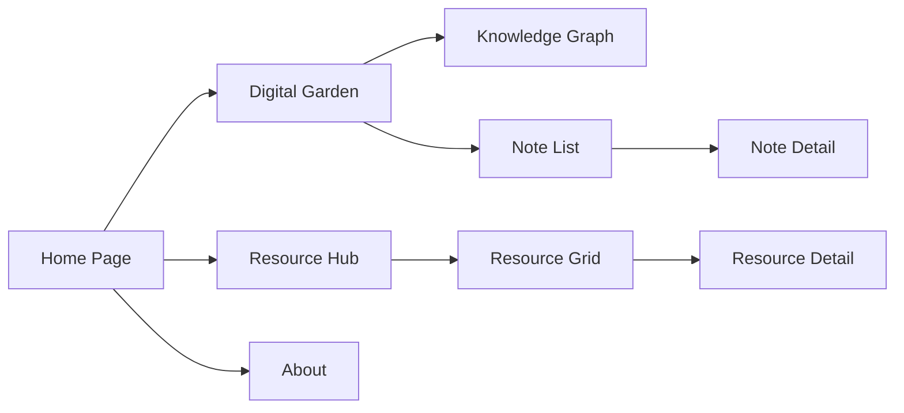

# Digital Garden & Resource Hub - GitHub Pages

## 1. Product Overview

A personal knowledge management and resource sharing platform built as GitHub Pages, featuring a Digital Garden for organizing personal notes and a Resource Hub for curated learning materials. Targeted at developers and knowledge workers seeking a clean, elegant digital workspace.

## 2. Core Features

### 2.1 User Roles
| Role | Registration Method | Core Permissions |
|------|---------------------|------------------|
| Visitor | No registration | Browse all public content |
| Owner | GitHub auth (future) | Manage content via markdown files |

### 2.2 Feature Modules
1. **Home Page**: Hero section, navigation, featured content, recent updates
2. **Digital Garden**: Knowledge graph visualization, note browsing, tag filtering, search
3. **Resource Hub**: Categorized resources, bookmarking, filtering by type/topic
4. **About**: Personal profile, project info, contact

### 2.3 Page Details

| Page Name | Module Name | Feature Description |
|-----------|-------------|---------------------|
| Home | Hero Section | Animated gradient background, title, brief intro |
| Home | Navigation | Fixed top nav with logo and links |
| Home | Featured | Cards showing recent notes and resources |
| Digital Garden | Knowledge Graph | Interactive graph showing note connections |
| Digital Garden | Note List | Paginated/categorized notes with tags |
| Digital Garden | Note Detail | Full markdown rendering, backlinks, related notes |
| Digital Garden | Search | Full-text search across all notes |
| Resource Hub | Resource Grid | Card-based grid of resources |
| Resource Hub | Filtering | Filter by category, type, tags |
| Resource Hub | Resource Detail | Full resource info, external link |
| About | Profile | Avatar, bio, skills, stats |

## 3. Core Process

**Note Browsing Flow:**
User visits Home → Clicks "Digital Garden" → Views knowledge graph or note list → Filters by tag → Clicks note → Reads detail with backlinks

**Resource Discovery Flow:**
User visits Home → Clicks "Resource Hub" → Views categorized resources → Filters by type → Clicks resource → Views detail → Opens external link

## 4. User Interface Design

### 4.1 Design Style
- **Primary Color**: Deep emerald green (#10b981) - representing growth and nature
- **Secondary Color**: Warm amber (#f59e0b) - highlighting and accent
- **Background**: Dark slate (#0f172a) - clean, focused reading experience
- **Button Style**: Rounded (8px), subtle hover effects, gradient accents
- **Font**: Georgia/serif for content (readable), Inter for UI elements
- **Layout**: Card-based with generous spacing, sidebar for navigation
- **Icons**: Lucide React - clean, minimalist

### 4.2 Page Design Overview

| Page Name | Module Name | UI Elements |
|-----------|-------------|-------------|
| Home | Hero | Large title, animated gradient background, CTA buttons |
| Home | Featured | Card grid with hover shadows, thumbnail previews |
| Digital Garden | Graph | Canvas-based interactive graph, zoom/pan |
| Digital Garden | List | Masonry-style card layout, tag badges |
| Digital Garden | Detail | Full-width content, table of contents, related notes sidebar |
| Resource Hub | Grid | Responsive card grid, category tabs |
| Resource Hub | Detail | Resource info panel, external link button |
| About | Profile | Avatar circle, skill tags, stat counters |

### 4.3 Responsiveness
- Desktop-first design with mobile-adaptive layout
- Collapsible sidebar on mobile
- Stacked card layout on small screens
- Touch-optimized interactive elements

### 4.4 Interactions
- Smooth page transitions
- Hover effects on cards and buttons
- Knowledge graph drag and zoom
- Search results with highlight
- Tag filtering animations
