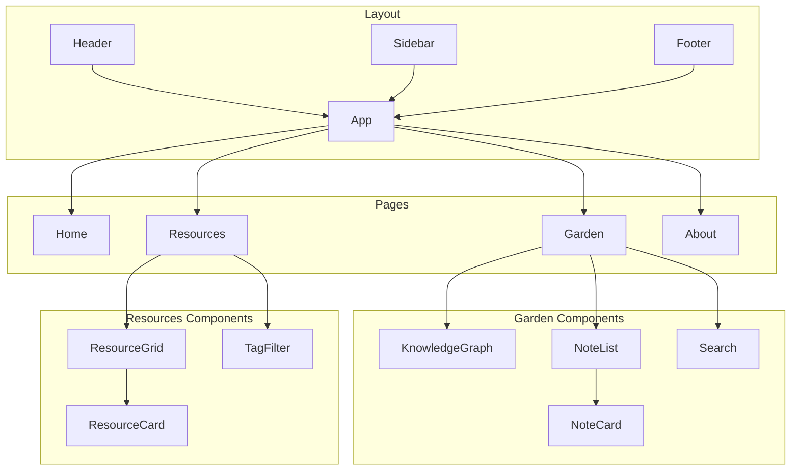

# Digital Garden & Resource Hub - Technical Architecture

## 1. Architecture Design

```mermaid
flowchart TB
    subgraph Frontend ["React + Vite"]
        A[Home Page]
        B[Digital Garden]
        C[Resource Hub]
        D[About]
        E[Navigation]
    end
    
    subgraph Data Layer ["Markdown Files"]
        F[Notes Directory]
        G[Resources Directory]
        H[Config Files]
    end
    
    subgraph Static Site Generation
        I[Vite Build]
        J[GitHub Pages Deployment]
    end
    
    Frontend --> Data Layer
    Frontend --> I
    I --> J
```

## 2. Technology Description

- **Frontend Framework**: React@18 + TypeScript
- **Build Tool**: Vite@6
- **Styling**: TailwindCSS@3
- **Routing**: React Router DOM@7
- **State Management**: Zustand
- **Icons**: Lucide React
- **Markdown Rendering**: React Markdown + Remark GFM
- **Knowledge Graph**: React Flow or D3.js
- **Deployment**: GitHub Pages (static site)

## 3. Route Definitions

| Route | Purpose | Component |
|-------|---------|-----------|
| / | Home page with hero and featured content | Home.tsx |
| /garden | Digital Garden main page with knowledge graph | Garden.tsx |
| /garden/note/:slug | Individual note detail page | NoteDetail.tsx |
| /resources | Resource Hub main page | Resources.tsx |
| /resources/:slug | Individual resource detail page | ResourceDetail.tsx |
| /about | About page with profile | About.tsx |
| /404 | Page not found | NotFound.tsx |

## 4. Data Model

### 4.1 Data Structure

**Notes (Digital Garden)**
- Stored as markdown files in `data/notes/`
- YAML frontmatter for metadata
- Backlinks detected via [[wikilink]] syntax

**Resources**
- Stored as JSON in `data/resources.json`
- Categorized by type and topic

### 4.2 File Organization

```
data/
├── notes/
│   ├── note-slug-1.md
│   ├── note-slug-2.md
│   └── ...
├── resources.json
└── tags.json

src/
├── components/
│   ├── layout/
│   │   ├── Header.tsx
│   │   ├── Sidebar.tsx
│   │   └── Footer.tsx
│   ├── garden/
│   │   ├── KnowledgeGraph.tsx
│   │   ├── NoteCard.tsx
│   │   └── NoteList.tsx
│   ├── resources/
│   │   ├── ResourceCard.tsx
│   │   └── ResourceGrid.tsx
│   └── common/
│       ├── Search.tsx
│       ├── TagFilter.tsx
│       └── Card.tsx
├── pages/
│   ├── Home.tsx
│   ├── Garden.tsx
│   ├── NoteDetail.tsx
│   ├── Resources.tsx
│   ├── ResourceDetail.tsx
│   ├── About.tsx
│   └── NotFound.tsx
├── hooks/
│   ├── useNotes.ts
│   ├── useResources.ts
│   └── useSearch.ts
├── utils/
│   ├── markdownParser.ts
│   └── backlinkParser.ts
├── store/
│   └── appStore.ts
├── types/
│   └── index.ts
├── App.tsx
├── main.tsx
└── index.css
```

### 4.3 Type Definitions

```typescript
interface Note {
  id: string;
  slug: string;
  title: string;
  content: string;
  tags: string[];
  createdAt: string;
  updatedAt: string;
  backlinks: string[];
  links: string[];
}

interface Resource {
  id: string;
  slug: string;
  title: string;
  description: string;
  url: string;
  category: 'book' | 'article' | 'video' | 'tool' | 'course';
  topic: string;
  tags: string[];
  author?: string;
  year?: string;
}

interface Tag {
  name: string;
  count: number;
  type: 'note' | 'resource';
}
```

## 5. Component Architecture



## 6. Build and Deployment

- **Local Development**: `pnpm dev`
- **Production Build**: `pnpm build`
- **Preview**: `pnpm preview`
- **GitHub Pages**: Deploy via `gh-pages` package or GitHub Actions

## 7. Performance Considerations

- Static markdown parsing at build time
- Lazy loading for images and heavy components
- Code splitting for route-based components
- Optimized asset delivery via Vite
